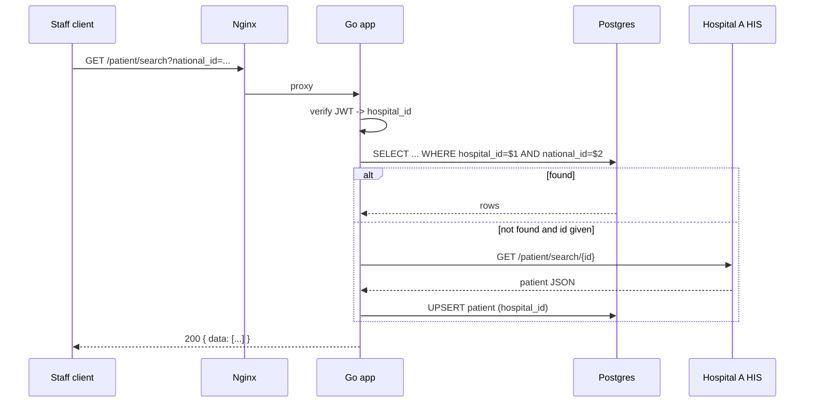

# Hospital Middleware — Development Plan

> Agnos Candidate Assignment (Back-end developer). Status: **v3 — implemented** (sections describe what was built).
> v2: structure follows `krok` (D11); search rules D9/D10 decided (D9: no criteria → paginated list, not 400).
> v3: `/staff/create` needs a login (D7) with seed data in `migrations/` (D12); implementation done, see §7 and §10.

## 1. Overview

A middleware service that lets hospital staff search patients. Each staff member belongs to one hospital and can only see patients of that hospital. Patient data originates from each hospital's HIS (Hospital Information System); Hospital A exposes `GET /patient/search/{id}`.

**Tech stack:** Go, Gin, PostgreSQL, Docker Compose, Nginx.

### Key design decisions (please review)

| # | Decision | Rationale |
|---|----------|-----------|
| D1 | **Search reads from our own Postgres**, not from the HIS on every request. | Assignment requires multi-field optional search (name, dob, phone, email) but Hospital A's API only supports lookup by `national_id`/`passport_id`. |
| D2 | **HIS fallback + cache:** if `national_id` or `passport_id` is given and there is no local match, call the hospital's HIS, upsert the result into `patients`, and return it. | Satisfies "search and display patient information from HIS" while keeping local search possible. |
| D3 | HIS access sits behind a `his.Client` **interface**, one implementation per hospital, resolved by hospital code. | Adding Hospital B = new adapter, no handler/service changes. Also makes tests easy (mock). |
| D4 | `hospital` in staff APIs is a **hospital code** (e.g. `hospital-a`), stored in a `hospitals` table. | Free-text hospital names would allow typos and cross-hospital leaks. |
| D5 | Username is unique **per hospital** (`UNIQUE(hospital_id, username)`), so login needs `hospital`. | Matches the required login input. |
| D6 | Auth = **JWT (HS256)** carrying `staff_id` and `hospital_id`; passwords hashed with **bcrypt**. | Stateless; hospital scoping is read from the token, never from client input on search. |
| D7 | `/staff/create` **requires a login token**. A staff member can only create staff **in their own hospital** (`hospital` in the body must equal the token's hospital, else `403`). | Decided in review. Avoids an open registration endpoint and keeps the "one hospital" scoping rule consistent. |
| D12 | **Bootstrap via migrations:** `migrations/` seeds master data — hospitals and one initial `admin` staff per hospital (bcrypt hash, documented dev-only password). | With `/staff/create` protected, the first staff must exist before anyone can log in. |
| D8 | `/patient/search` is `GET` with **query params**. | Read-only, cacheable semantics; spec says all inputs optional. |
| D9 | Search with **no criteria is valid** and returns the staff's hospital patients, **paginated** (default 20, max 100), ordered by `patient_hn`. | Spec says all inputs are optional; scope is still limited to the staff's hospital and pagination bounds the response. Decided in review (changed from 400). |
| D10 | A name param matches the **Thai or English** name column. | Spec gives no language on search names; decided in review. |
| D11 | Project is scaffolded with **`krok`** (`-f gin -d postgres`); layout is **feature-package based**. | Author's own generator; gives config/logger/httpx/server/Docker/test patterns. Our features replace its `items` example. |

### Open questions

1. Hospital A's real auth / sample response is not provided — assumed unauthenticated, JSON body exactly as listed. The HIS client is mocked in tests.
2. Any logged-in staff can create staff (no admin/role distinction). Roles are out of scope.

Resolved:
- `/staff/create` requires a login token (D7); initial staff come from migration seed data (D12).
- Search with **no criteria** → `200` with the hospital's patients, paginated (D9). Not an error.
- `first_name` / `middle_name` / `last_name` in search have no language suffix → match **either** the Thai or English name (D10).

## 2. Project Structure

Generated with [`krok`](https://github.com/DoIttikorn/krok) (D11):

```bash
krok new hospital-middleware -f gin -d postgres -m github.com/DoIttikorn/hospital-middleware
```

krok's example `items` feature was replaced by our `hospital`, `staff` and `patient` features. Marks: **[krok]** generated as-is, **[krok→edit]** generated then adapted, **[new]** added by us, **[removed]** deleted after generation. This is the structure **as built**.

```
hospital-middleware/
├── api/api.http                     # [new] REST Client requests for trying every endpoint by hand
├── cmd/api/main.go                  # [krok] entry point (unchanged)
├── internal/
│   ├── config/                      # [krok] loads .env
│   ├── database/                    # [krok→edit] pgx pool + [new] migrate.go (golang-migrate, embedded SQL)
│   │   └── dbtest/                  # [new] integration-test helpers: Open (skips without INTEGRATION), NewHospital
│   ├── httpx/                       # [krok→edit] RFC 9457 problems + machine-readable `code` extension
│   ├── logger/                      # [krok] slog
│   ├── ids/                         # [new] UUID v4 generator
│   ├── server/                      # [krok→edit] server.go (wiring, JWT/HIS config), routes.go, health.go; end-to-end API tests
│   ├── auth/                        # [new] JWT (HS256) manager, bcrypt helpers, Gin middleware
│   ├── his/                         # [new] HIS adapters
│   │   ├── hospital_a.go            #       Hospital A HTTP client (implements patient.HISClient)
│   │   ├── registry.go              #       hospital -> client (implements patient.HISRegistry)
│   │   └── histest/                 #       fake client + registry for tests
│   ├── hospital/                    # [new] domain: model, Service + Repository (ByCode, ByID), memory/, postgres/, hospitaltest/ (contract)
│   ├── staff/                       # [new] domain (replaces items)
│   │   ├── staff.go  repository.go  service.go  service_test.go
│   │   ├── handler/                 #       POST /staff/login, POST /staff/create (+ tests)
│   │   ├── memory/  postgres/       #       repository adapters
│   │   └── stafftest/               #       repository contract
│   └── patient/                     # [new] domain (replaces items)
│       ├── patient.go  repository.go  his.go  service.go  service_test.go
│       ├── handler/                 #       GET /patient/search (+ tests)
│       ├── memory/  postgres/       #       repository adapters
│       └── patienttest/             #       repository contract
├── migrations/                      # [new] embedded SQL migrations (D12)
│   ├── embed.go                     #       go:embed of the .sql files
│   ├── 000001_init_schema.up/down.sql        #  hospitals, staff, patients + constraints/indexes
│   └── 000002_seed_master_data.up/down.sql   #  hospitals (hospital-a, hospital-b) + initial admin staff per hospital
├── deploy/nginx/nginx.conf          # [new] reverse proxy :80 -> app:8080   ([removed] deploy/k8s)
├── docs/                            # PLAN.md (this file), er-diagram.drawio
├── .air.toml  .dockerignore  Dockerfile  # [krok]
├── .env  .env.example  .gitignore   # [krok→edit] new settings; .env.example is committed, .env is not
├── docker-compose.yml               # [krok→edit] + nginx; only nginx publishes the app to the host
├── Makefile                         # [krok→edit] k8s targets removed, test-cover added, loads .env
├── README.md                        # [new] run, seed credentials, API, tests
└── go.mod
```

**Layering:** ports and adapters, per domain. The domain package (`staff`, `patient`, `hospital`) holds the model, the business rules (`Service`) and the ports (`Repository`; for patients also `HISClient` / `HISRegistry`). `memory/` and `postgres/` implement the repository, `handler/` is the REST adapter and the only place importing Gin, and `*test/` is the contract every repository adapter must pass. Domain packages import no driver and no web framework. `internal/server/server.go` is the single composition root. Dependencies: `staff` → `hospital`, `auth`; `patient` → `hospital`; `his` → `patient`, `hospital`. A domain uses another domain through its `Service`, never its `Repository`: `hospital.Service` is passed to `staff` and `patient`, which each declare a narrow `Hospitals` interface with only the methods they call (`ByCode` for staff, `ByID` for patient).

**Libraries:** krok's choices (Gin, `database/sql` with the pgx driver, slog) are kept. Added: `golang-jwt/jwt/v5`, `golang.org/x/crypto/bcrypt`, `golang-migrate/migrate/v4` (pgx v5 driver, embedded source). Tests use the standard `testing` package like krok's, not testify.

**Verified after generation:** krok ships no migration tool (its `items` adapter created its own table), so `golang-migrate` was added; `.env` is loaded by `godotenv` and the other settings are read with `os.Getenv`; krok's contract-test pattern (skip unless `INTEGRATION=1`) was kept, and integration tests use their own hospitals instead of clearing tables so packages can run in parallel.

## 3. Database Schema

See `er-diagram.drawio`. Summary:

### `hospitals`
| column | type | notes |
|---|---|---|
| id | UUID PK | |
| code | VARCHAR(50) UNIQUE NOT NULL | e.g. `hospital-a` |
| name | VARCHAR(255) NOT NULL | |
| his_base_url | VARCHAR(255) | HIS endpoint, nullable |
| created_at | TIMESTAMPTZ | |

### `staff`
| column | type | notes |
|---|---|---|
| id | UUID PK | |
| hospital_id | UUID FK → hospitals.id NOT NULL | scopes all patient access |
| username | VARCHAR(100) NOT NULL | |
| password_hash | VARCHAR(255) NOT NULL | bcrypt |
| created_at / updated_at | TIMESTAMPTZ | |

`UNIQUE (hospital_id, username)`

### `patients`
Fields mirror the Hospital A response so other HIS payloads can be mapped onto the same shape.

| column | type | notes |
|---|---|---|
| id | UUID PK | |
| hospital_id | UUID FK → hospitals.id NOT NULL | |
| patient_hn | VARCHAR(50) NOT NULL | hospital number |
| national_id | VARCHAR(20) | nullable |
| passport_id | VARCHAR(20) | nullable |
| first_name_th / middle_name_th / last_name_th | VARCHAR(100) | nullable |
| first_name_en / middle_name_en / last_name_en | VARCHAR(100) | nullable |
| date_of_birth | DATE | |
| phone_number | VARCHAR(30) | |
| email | VARCHAR(255) | |
| gender | CHAR(1) | `CHECK (gender IN ('M','F'))` |
| created_at / updated_at | TIMESTAMPTZ | |

Constraints and indexes:
- `UNIQUE (hospital_id, patient_hn)`
- Partial unique: `(hospital_id, national_id) WHERE national_id IS NOT NULL`, same for `passport_id`
- `CHECK (national_id IS NOT NULL OR passport_id IS NOT NULL)`
- Indexes on `(hospital_id, national_id)`, `(hospital_id, passport_id)`, `(hospital_id, date_of_birth)`
- `pg_trgm` GIN indexes on name columns for `ILIKE` prefix/contains search (optional optimisation)

**Why `hospital_id` on patient:** the same person can be a patient at several hospitals with different HNs; rows are per hospital, which is what makes the "same hospital only" rule a simple `WHERE hospital_id = $staff_hospital`.

## 4. API Spec

Base path via Nginx: `http://localhost/` → app `:8080`. All bodies are JSON. Errors are [RFC 9457](https://www.rfc-editor.org/rfc/rfc9457) problem details (`application/problem+json`, krok's convention) plus a machine-readable `code`:

```json
{ "title": "Unauthorized", "status": 401, "detail": "invalid username or password", "code": "invalid_credentials" }
```

| Status | `code` |
|---|---|
| 400 | `validation_error` (invalid input), `bad_request` (malformed JSON / unknown field) |
| 401 | `unauthorized` (token), `invalid_credentials` (login) |
| 403 | `hospital_mismatch` |
| 404 | `hospital_not_found` |
| 409 | `username_taken` |
| 502 | `his_unavailable` |
| 500 | none; details are logged, never sent |

### 4.1 `POST /staff/create` 🔒

Header: `Authorization: Bearer <jwt>`. The new staff is created in the caller's hospital only (D7).

Request:
```json
{ "username": "nurse01", "password": "s3cretPass!", "hospital": "hospital-a" }
```
| Field | Rules |
|---|---|
| username | required, 3–100 chars |
| password | required, min 8 chars |
| hospital | required, must match an existing hospital code |

Responses:
- `201` `{ "id": "...", "username": "nurse01", "hospital": "hospital-a" }`
- `400` validation error · `401` missing/invalid/expired token · `403` `hospital` differs from the caller's hospital · `404` unknown hospital · `409` username already exists in that hospital

### 4.2 `POST /staff/login`

Request: same three fields.

Responses:
- `200` `{ "token": "<jwt>", "token_type": "Bearer", "expires_in": 3600 }`
- `400` validation error
- `401` invalid credentials (same message for unknown user / wrong password / unknown hospital, to avoid user enumeration)

### 4.3 `GET /patient/search` 🔒

Header: `Authorization: Bearer <jwt>`

Query params (all optional): `national_id`, `passport_id`, `first_name`, `middle_name`, `last_name`, `date_of_birth` (`DD/MM/YYYY`), `phone_number`, `email`. `national_id` and `passport_id` may only contain ASCII letters and digits, at most 20 (the column size); they are sent to the HIS in the URL path.

All criteria are optional (D9). Blank values are treated as absent. With no criteria, the response is the staff's hospital patients ordered by `patient_hn`, paginated by `limit`/`offset`.

Matching: ids, phone, email and dob → exact; names → case-insensitive prefix match against Thai **or** English name (D10), e.g. `first_name=som` matches `first_name_th` or `first_name_en`. Multiple params are AND-ed. Results are always restricted to `hospital_id` from the JWT.

Pagination: `limit` (default 20, max 100), `offset` (default 0).

Response `200`:
```json
{
  "total": 1,
  "limit": 20,
  "offset": 0,
  "data": [
    {
      "first_name_th": "สมชาย", "middle_name_th": "", "last_name_th": "ใจดี",
      "first_name_en": "Somchai", "middle_name_en": "", "last_name_en": "Jaidee",
      "date_of_birth": "1990-05-17",
      "patient_hn": "HN0001234",
      "national_id": "1234567890123",
      "passport_id": null,
      "phone_number": "0812345678",
      "email": "somchai@example.com",
      "gender": "M"
    }
  ]
}
```
Errors: `400` bad `date_of_birth` format / `national_id` or `passport_id` not 1–20 letters and digits / invalid `limit` or `offset` · `401` missing/invalid/expired token.

**HIS fallback (D2):** if `national_id` or `passport_id` is present and the local query returns 0 rows, the service calls `his.Client.FindByID(id)` for the staff's hospital, upserts the patient under that hospital, and returns it. HIS `404` → empty result; HIS timeout/5xx → `502` `his_unavailable`.

### 4.4 Hospital A (external, consumed)

`GET https://hospital-a.api.co.th/patient/search/{id}` → response fields as in the assignment. Client uses a 5 s timeout and treats `404` as "not found".

### 4.5 Sequence — patient search



## 5. Infrastructure

`docker-compose.yml` starts from krok's generated file (postgres + app) and adds nginx:
- **postgres** — from krok; ensure named volume and `pg_isready` healthcheck
- **app** — built from krok's `Dockerfile`; runs migrations on start, depends on postgres healthy; env from `.env`
- **nginx** — [new] `nginx:alpine`, mounts `deploy/nginx/nginx.conf`, proxies `:80` → `app:8080`; only nginx publishes a host port (app port is `expose`d only)

Config env vars: krok's defaults (`PORT`, `DB_*`, `LOG_*`) plus `JWT_SECRET` (required, ≥ 16 bytes), `JWT_TTL_MINUTES` (60), `HIS_TIMEOUT_SECONDS` (5), `HOSPITAL_A_BASE_URL` (optional override of the HIS address stored with `hospital-a`, e.g. for a local mock) and `HTTP_PORT` (host port of nginx, 80). Compose provides dev-only defaults for all of them; see `.env.example`.

Migrations are embedded in the binary and applied at startup (`golang-migrate` holds an advisory lock, so replicas can start together).

## 6. Testing Strategy

Unit tests per API, positive and negative, table-driven, with the standard `testing` package.

| Layer | Approach |
|---|---|
| Handlers (`*/handler`) | `httptest` + Gin, real service over the `memory/` repo or a stub service |
| Services | `memory/` repositories and the `histest` fake HIS (follows krok's `items` test pattern) |
| JWT middleware (`auth`) | valid / missing / malformed / expired / wrong-signature token |
| HIS Hospital A client | `httptest.Server` returning 200 / 404 / 500 / timeout / bad JSON |
| `postgres/` repositories | the shared contract (`hospitaltest`, `stafftest`, `patienttest`) against the compose Postgres, with `INTEGRATION=1` (`make test-integration`) |
| End to end | `internal/server/api_test.go`: router + middleware + handlers + services + memory adapters |

Scenarios:

| API | Positive | Negative |
|---|---|---|
| `/staff/create` | with valid token creates staff in own hospital, password stored hashed, new staff can then log in | no token, invalid/expired token, `hospital` ≠ caller's hospital (403), missing field, short password, unknown hospital, duplicate username in same hospital (409); same username in another hospital is allowed |
| `/staff/login` | returns valid token with correct claims | wrong password, unknown user, unknown hospital, missing field |
| `/patient/search` | by national_id, by passport_id, by name matching Thai column, by name matching English column, by dob, combined filters, **no criteria → 200 with hospital's patients**, blank-string criteria treated as absent, pagination (default, custom, max cap), HIS fallback + upsert | no token, expired token, other hospital's patient not returned (also with no criteria), bad dob, bad `limit`/`offset`, HIS 404 → empty, HIS 5xx → 502 |

Target: ≥ 80 % coverage on `handler`, `service`, `auth`, `his`. `postgres/` repositories are covered by krok's repository tests against the compose Postgres.

## 7. Implementation Plan

| Step | Work | Status |
|---|---|---|
| 1 | `krok new ...`, remove `deploy/k8s` and the `items` example, add nginx to compose, extend config/env; confirm the generated project builds and tests pass | | ✅ done |
| 2 | Migrations (schema + master-data seed: hospitals, initial admin staff); `hospital`, `staff`, `patient` entities and `postgres/` repositories | | ✅ done |
| 3 | `auth` (JWT + bcrypt), JWT middleware + tests | | ✅ done |
| 4 | `/staff/login`, `/staff/create` (protected) + tests | | ✅ done |
| 5 | `his` client interface + Hospital A adapter + tests | | ✅ done |
| 6 | `/patient/search` service/handler (optional criteria, hospital scope, pagination, HIS fallback) + tests | | ✅ done |
| 7 | README (run, test, curl examples), final review | | ✅ done |

## 8. Out of Scope

Rate limiting, refresh tokens, RBAC/admin roles (any logged-in staff may create staff in their own hospital), audit logging, HIS write-back, real Hospital A credentials.

## 9. Seed Data (migration `000002`)

| Table | Row | Notes |
|---|---|---|
| hospitals | `hospital-a` — Hospital A, `his_base_url = https://hospital-a.api.co.th` | fixed UUID |
| hospitals | `hospital-b` — Hospital B, `his_base_url = NULL` | no HIS adapter yet; search works on local data only; HIS fallback returns empty |
| staff | `admin` @ hospital-a | bcrypt hash; **dev-only** password documented in README |
| staff | `admin` @ hospital-b | same |

Seed passwords are for local/demo use and must be changed or removed for any real deployment.

## 10. Implementation Notes

**Verification done**
- `go vet` and `gofmt` clean; unit tests pass (`make test`); the repository contracts also pass against real Postgres 17 (`make test-integration`), including packages running in parallel.
- Coverage (`make test-cover`): `auth` 100 %, `his` ~98 %, `patient` 93 %, `staff` 93 %, `patient/handler` 91 %, `staff/handler` 91 %; memory adapters 100 %. The `postgres/` packages report 0 % in a plain `make test-cover` because their contract tests are skipped without `INTEGRATION=1`.
- Full stack via `docker compose up --build` (nginx → app → postgres): login, protected `/staff/create` (201 / 401 / 403 / 409), `/patient/search` (no criteria, bad date, 401), and the HIS fallback against a local mock Hospital A (`HOSPITAL_A_BASE_URL`): one HIS call, patient cached, searchable by name in Hospital A, invisible to Hospital B.

**Decisions made during implementation**
- Validation errors are `400` (not krok's `422` for invalid input) to match this spec; malformed JSON is also `400`.
- `limit` above 100 is **clamped** to 100; a non-numeric or negative `limit`/`offset` is `400`.
- `national_id` / `passport_id` with anything but letters and digits (e.g. `/`, `..`, spaces, hyphens) or longer than 20 is `400`, checked before the database or the HIS is asked, so an identifier can never change the HIS request path.
- The postgres adapters compare `hospital_id = $1::uuid` rather than casting the column to text, so the `(hospital_id, ...)` indexes serve every hospital-scoped query.
- Passwords are limited to 72 bytes (bcrypt's limit) and rejected above it instead of being truncated.
- Login gives the same `401` for an unknown hospital, unknown user and wrong password, and runs a dummy bcrypt comparison so timing does not tell them apart.
- A HIS record without `patient_hn` is rejected (`502`); if it lacks the identifier it was searched by, that identifier is stored so the patient can be found again.
- Hospital B has no HIS adapter, so an identifier search there is answered from local data only.

**Known limitations**
- Upsert conflicts on `(hospital_id, patient_hn)`. If a HIS returns an existing `national_id` under a *different* HN, the partial unique index rejects it and the search fails with `500`. Not handled; it needs a rule for merging patients.
- `hospital-a.api.co.th` is not a live service, so an identifier search for a patient that is not stored yields `502 his_unavailable` unless `HOSPITAL_A_BASE_URL` points at a mock.
- Any logged-in staff member may create staff in their own hospital (no roles), and the seed `admin` passwords are dev-only.
- No rate limiting on login.
